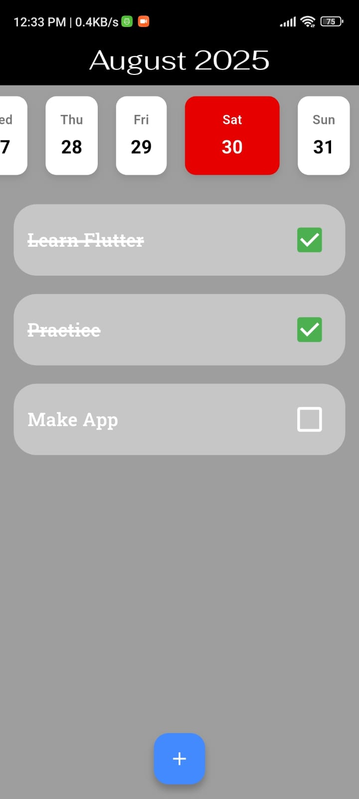
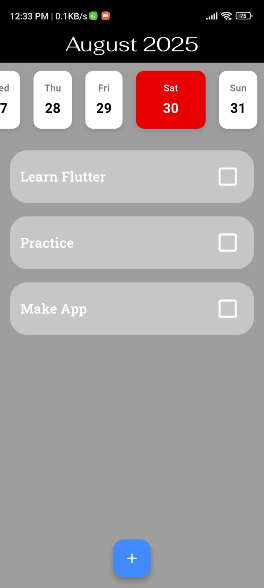

# Todo App

A beautiful and functional Flutter todo application with a modern UI design and persistent data storage.

## 📱 Features

- **Task Management**: Add, complete, and track your daily tasks
- **Persistent Storage**: Tasks are automatically saved using SharedPreferences
- **Calendar View**: Interactive horizontal calendar showing current month
- **Modern UI**: Clean and intuitive interface with Material Design
- **Cross-Platform**: Works on Android, iOS, Web, Windows, macOS, and Linux
- **Responsive Design**: Adapts to different screen sizes

## 📸 Screenshots

## 📸 Screenshots

### Home Screen  
[](s.jpg)

### Calendar View  
[](s1.jpg)


## 🎥 Demo Video

[▶️ Watch Demo](s.mp4)


The app features:
- A sleek black app bar with the current month and year
- A horizontal scrollable calendar showing all days of the current month
- Today's date highlighted in red
- Task cards with checkboxes for completion status
- Floating action button to add new tasks
- Persistent storage that remembers your tasks between app sessions

## 🚀 Getting Started

### Prerequisites

- Flutter SDK (version 3.8.1 or higher)
- Dart SDK
- Android Studio / VS Code
- Git

### Installation

1. **Clone the repository**
   ```bash
   git clone <repository-url>
   cd todo_app
   ```

2. **Install dependencies**
   ```bash
   flutter pub get
   ```

3. **Run the app**
   ```bash
   flutter run
   ```

## 📦 Dependencies

The app uses the following key dependencies:

- **flutter**: Core Flutter framework
- **google_fonts**: ^6.3.1 - Custom Google Fonts for better typography
- **intl**: ^0.20.2 - Internationalization and date formatting
- **shared_preferences**: ^2.5.3 - Local data persistence
- **cupertino_icons**: ^1.0.8 - iOS-style icons

## 🏗️ Project Structure

```
lib/
├── main.dart          # App entry point
├── HomePage.dart      # Main todo list interface
└── save_load.dart     # Data persistence logic
```

### Key Components

- **MyApp**: Root widget that sets up the MaterialApp
- **HomePage**: Main screen with calendar and todo list
- **Todo**: Data model for individual tasks
- **saveTodos/loadTodos**: Functions for persistent storage

## 🎯 Usage

1. **Adding Tasks**: Tap the floating action button (+) to add a new task
2. **Completing Tasks**: Check the checkbox next to any task to mark it as complete
3. **Calendar Navigation**: Scroll horizontally through the calendar to view different days
4. **Data Persistence**: Your tasks are automatically saved and will persist between app sessions

## 🔧 Development

### Running Tests
```bash
flutter test
```

### Building for Production
```bash
# Android APK
flutter build apk

# iOS
flutter build ios

# Web
flutter build web
```

## 📱 Platform Support

This Flutter app supports multiple platforms:
- ✅ Android
- ✅ iOS  
- ✅ Web
- ✅ Windows
- ✅ macOS
- ✅ Linux

## 🤝 Contributing

1. Fork the repository
2. Create a feature branch (`git checkout -b feature/AmazingFeature`)
3. Commit your changes (`git commit -m 'Add some AmazingFeature'`)
4. Push to the branch (`git push origin feature/AmazingFeature`)
5. Open a Pull Request

## 📄 License

This project is licensed under the MIT License - see the LICENSE file for details.

## 🙏 Acknowledgments

- Flutter team for the amazing framework
- Google Fonts for beautiful typography
- The Flutter community for excellent packages and resources

---

**Note**: This is a Flutter project created for learning and demonstration purposes. Feel free to modify and extend it according to your needs!
